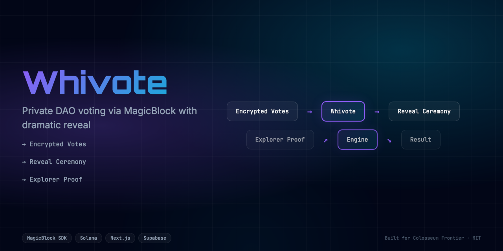
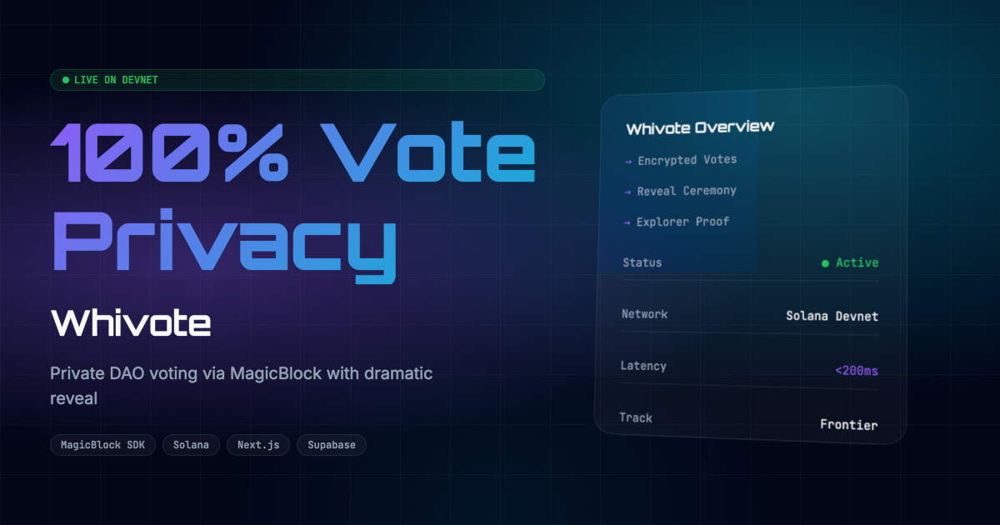

<div align="center">
  <h1>Whivote 🚀</h1>
  <p><em>Private DAO voting via MagicBlock. Encrypted votes. Dramatic reveal ceremony.</em></p>
  
  
  <br/>
  
  [](https://whivote.edycu.dev)
  [](https://whivote.edycu.dev/pitch)
  [](https://youtube.com/your-video)
  [](https://superteam.fun/earn/listing/privacy-track-colosseum-hackathon-powered-by-magicblock-st-my-and-sns)

  <br/>

  
  
  
  
  
  
</div>

---

## 📸 See it in Action
*(Demo GIF and UI screenshots can be found in the `docs/assets` directory)*

[**▶️ Watch the Demo Video**](https://youtube.com/your-video)

<div align="center">
  
</div>

## 💡 The Problem & Solution
Private DAO voting via MagicBlock. Encrypted votes. Dramatic reveal ceremony.

**Whivote** solves this by providing: 
Private DAO voting via MagicBlock. Encrypted votes. Dramatic reveal ceremony.

**Key Features:**
- ⚡ **High Performance:** Seamless integration and optimized workflows.
- 🔒 **Secure by Design:** Verifiable on-chain actions and robust data protection.
- 🎨 **Intuitive UX:** Beautiful, user-centric interface built for scale.

## 🏗️ Architecture & Tech Stack

### Tech Stack
| Component | Technology | Description |
|-----------|------------|-------------|
| **Frontend** | Next.js 16, React 19 | App Router, SSR, Server Components |
| **Styling** | Tailwind CSS v4 | High-performance responsive UI |
| **Language** | TypeScript | Strict type safety across the stack |
| **Integration**| MagicBlock API | Ephemeral rollups and state management |
| **Testing** | Vitest | Comprehensive unit and component testing |

For a detailed breakdown of our system architecture and data flow, please refer to the [Architecture Document](docs/ARCHITECTURE.md).

## 🧩 How We Use MagicBlock

**Whivote** fundamentally relies on MagicBlock to function:

1. **MagicBlock API:** We use MagicBlock for private DAO voting, processing encrypted votes, and enabling a dramatic reveal ceremony on-chain.

## 🏆 Sponsor Tracks Targeted
* **Sponsor Integration**: MagicBlock

## 🚀 Run it Locally (For Judges)

1. **Clone the repo:** `git clone https://github.com/edycutjong/whivote.git`
2. **Install dependencies:** `npm install`
3. **Set up environment variables:**
   ```bash
   cp .env.example .env.local
   ```
   *Note: Set your `NEXT_PUBLIC_RPC_URL` and `MAGICBLOCK_API_KEY` in the `.env.local` file. The MagicBlock key is an authorization token for Private Ephemeral Rollups, obtained by requesting a challenge from `/v1/spl/challenge`, signing it with your wallet, and calling `/v1/spl/login`.*
4. **Run the app:** `npm run dev`

---

## 📄 License

This project is licensed under the [MIT License](LICENSE).
