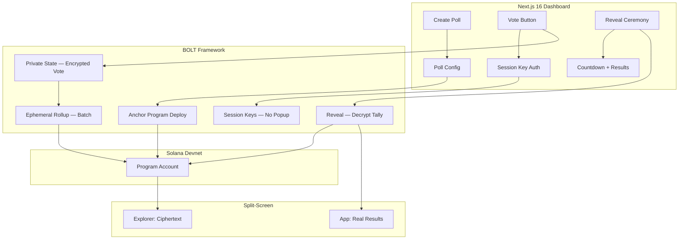

# Whivote — Technical Architecture

## System Architecture



## Tech Stack

| Layer | Technology |
|---|---|
| **Frontend** | Next.js 16, React 19, Tailwind v4 |
| **On-Chain** | Anchor, BOLT Framework (MagicBlock) |
| **Privacy** | MagicBlock Private State |
| **Batching** | Ephemeral Rollups |
| **UX** | Session Keys |

## MagicBlock SDK Integration Map

| Feature | Use Case | Depth |
|---|---|---|
| **Private State** | Encrypt each vote on-chain | 🟢 Core |
| **Ephemeral Rollups** | Batch votes for gas efficiency | 🟢 Core |
| **Session Keys** | Vote without wallet popup per vote | 🟢 Core |
| **BOLT Counter Pattern** | Fork + adapt for encrypted count | 🟢 Base |
| **Reveal Logic** | Decrypt accumulated tally at deadline | 🟢 Star Feature |

## On-Chain Program (Anchor)

```rust
// Simplified Anchor account structure
#[account]
pub struct Poll {
    pub title: String,
    pub options: Vec<String>,
    pub encrypted_tallies: Vec<[u8; 32]>,  // Private State
    pub deadline: i64,
    pub revealed: bool,
    pub authority: Pubkey,
}

#[account]
pub struct Vote {
    pub poll: Pubkey,
    pub voter: Pubkey,           // Session Key, not wallet
    pub encrypted_choice: [u8; 32],  // Private State
    pub timestamp: i64,
}
```

## API Routes

| Method | Path | Description |
|---|---|---|
| POST | `/api/polls` | Create poll with options + deadline |
| GET | `/api/polls` | List active/ended polls |
| POST | `/api/polls/:id/vote` | Submit encrypted vote via Session Key |
| POST | `/api/polls/:id/reveal` | Trigger reveal ceremony |
| GET | `/api/polls/:id/results` | Get revealed results |

## Database Schema (off-chain cache)

```sql
CREATE TABLE polls (
    id UUID PRIMARY KEY DEFAULT gen_random_uuid(),
    on_chain_pubkey TEXT UNIQUE,
    title TEXT NOT NULL,
    options TEXT[] NOT NULL,
    deadline TIMESTAMPTZ NOT NULL,
    revealed BOOLEAN DEFAULT FALSE,
    results JSONB,
    created_at TIMESTAMPTZ DEFAULT NOW()
);
```
